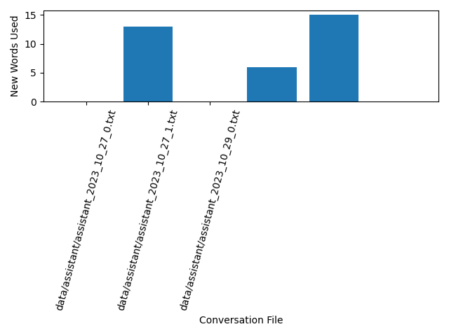

### Dictionary evaluator
This can be used to improve the speech dictionary.  
1. Make a voice conversation with the Chat-GPT mobile.
2. Sent this message to the Chat-GPT assistant:
```
Please, 
1. Collect all my speech in a single text variable
2. Collect all your speech in another text variable
```
Please, note, that GPT-4 will not be able to contain a long conversations due it's short context window. So, you need to make a short conversation.  
Or you can use Claude-2 with 100k context window with the following prompt:
```
Please, separate this conversation by two speakers.
First, I need a text from the first speaker.
```
And then the next:
```
Now, I need a text from the second speaker.
```
3. Save each text to files:
```
data/user/user_2023_10_27_0.txt
data/assistant/assistant_2023_10_27_0.txt
```
4. Run the evaluator:
```
python3 evaluator.py
```
5. The evaluator will create 3 files:
```
Words Exclusively Spoken by User.png
Words Exclusively Spoken by Assistant.png
assistant_only.txt
```
In addition, the user's unique word count will be printed to the console:
```
285 - Count of overall words that persist in the user's text
543 - Count of overall words that persist in the assistant's text
126 - Count of words that persist only in the user's text
384 - Count of words that persist only in the assistant's text
data/assistant/assistant_2023_10_27_0.txt 0 words reused by user:
data/assistant/assistant_2023_10_27_0.txt set() 

data/assistant/assistant_2023_10_27_0.txt 53 0 words only used by assistant
data/assistant/assistant_2023_10_27_1.txt 13 words reused by user:
data/assistant/assistant_2023_10_27_1.txt {'do', 'any', 'or', 'more', 'way', 'have', 'on', 'anything', 'sounds', 'out', 'can', 'ask', 'find'} 

data/assistant/assistant_2023_10_27_1.txt 0 words reused by user:
data/assistant/assistant_2023_10_27_1.txt set() 

data/assistant/assistant_2023_10_27_1.txt 367 13 words only used by assistant
```
You can use this as a metric to improve the speech dictionary. And you can choose the words in the assistant_only.txt file to learn them for use in further speech.  
  
  
  

